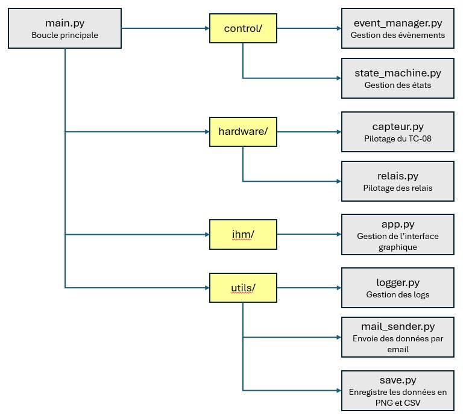
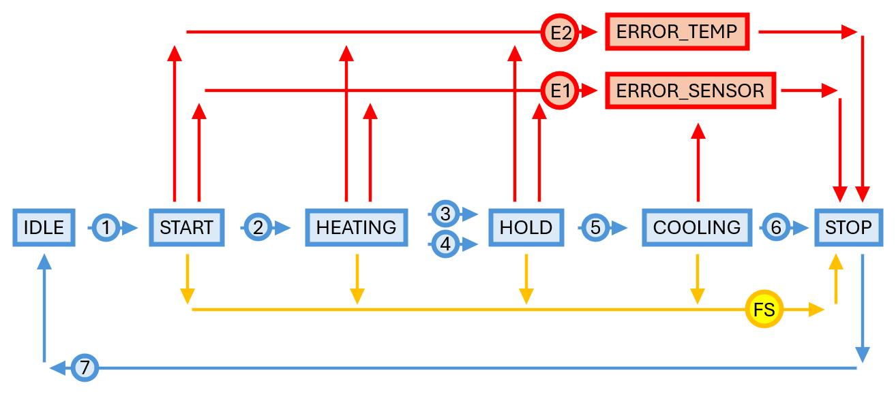

# Système de contrôle de l'étuve Halcyon

Ce projet s'inscrit dans le cadre du projet de fin d'étude (PFE) de Mathieu GROSSIN, étudiant-ingénieur à l'INSA Rennes en Génie Mécanique et Automatique (spécialité GMA, promotion 2025-2026). Il vise à automatiser l'étuve de la société Halcyon, située à Saint-Jacques-de-la-Lande (près de Rennes), qui sert à polymériser des colles structurales haute performance (Redux 312L) et à effectuer des revenus thermiques sur des tôles d'aluminium formées incrémentalement.

## Contexte du projet

Début 2025, Halcyon a adopté la colle structurale Redux 312L (HexBond™) pour la fabrication de pièces spatiales destinées notamment à Maiaspace (filiale d'ArianeGroup). Cette colle nécessite un cycle de polymérisation précis à 120°C ± 5°C avec maintien en température et mise sous vide. Une étuve industrielle de 3 m × 3,5 m × 2 m a été conçue et fabriquée en interne début 2025.

L'installation initiale utilisait le chauffage à air pulsé Sovelor ETV22 avec commande manuelle, ne permettant pas de piloter le cycle depuis un système extérieur. Ce projet vise à rendre l'étuve entièrement pilotable et automatisée.

## Objectifs du projet

**Objectif 1 (principal) — Pilotage et automatisation :**
- Modifier le système de pilotage du chauffage Sovelor ETV22
- Automatiser ce nouveau système de pilotage via un Raspberry Pi 5
- Ajouter un système de mesure du vide (capteur de pression CP01)
- Créer une IHM permettant la saisie des cycles de chauffe et l'affichage des données en temps réel

**Objectif 2 — Sécurisation et amélioration du caisson :**
- Conception d'une trappe de secours interne (norme NF EN 547)
- Installation de fenêtres à double vitrage (température de surface validée à 24°C par modèles analytique et ABAQUS)
- Remplacement de la structure interne en bois modifié thermiquement (BMT) par des poutres en vermiculite comprimée pour éliminer le risque d'incendie
- Amélioration de l'isolation thermique (modélisation ABAQUS)

**Objectif 3 — Conduites de ventilation :**
- Isolation des gaines de circulation d'air (réduction de la densité de flux thermique de ~95%)
- Réduction des pertes calorifiques et accélération de la descente en température

## Description du système logiciel

L'application permet de piloter l'étuve via une interface graphique locale tournant sur la Raspberry Pi 5.

Elle assure :
- le choix du cycle de chauffe (température cible, durée de maintien, activation pompe)
- l'affichage en temps réel des capteurs (7 températures + pression), sous forme de valeurs instantanées et de courbes
- le pilotage des relais reliés aux différents composants électriques du chauffage (résistance 15kW, résistance 7,5kW, ventilation, pompe à vide, servomoteur)
- l'enregistrement des données (CSV et PNG) et l'archivage sur serveur NAS
- la gestion des erreurs avec alertes sonores et visuelles (balise Banshee Excel Lite Xenon)
- l'envoi d'alertes par e-mail en cas d'erreur

L'application fonctionne en local sur la Raspberry Pi 5, avec démarrage automatique via un service systemd (`etuve.service`).

## Architecture matérielle

**Le système est composé des éléments suivants :**

| Composant | Référence | Rôle |
|-----------|-----------|------|
| Raspberry Pi 5 (8 Go) | — | Contrôle central du système |
| Enregistreur TC-08 | Pico Technology | Acquisition des températures et pression (USB) |
| Capteur de pression | CP01 (Instrumentys) | Mesure vide dans la pièce (0,5–4,5 V / 4–20 mA via PP624) |
| Carte 8 relais | Reichelt (5V SRD) | Pilotage des composants électriques via GPIO |
| Chauffage | Sovelor ETV22 (22,5 kW) | Générateur d'air chaud (modifié pour pilotage externe) |
| Pompe à vide | DVP LC 40 | Maintien du vide lors de la polymérisation |
| Servomoteur | Belimo CM230-L | Ouverture/fermeture arrivée d'air frais |
| Alarme | Banshee Excel Lite Xenon | Alerte sonore et visuelle en cas d'erreur |
| Écran + Clavier/Souris | — | Interface opérateur |

**Caractéristiques du chauffage ETV22 :**

| Caractéristique | Valeur |
|---|---|
| Puissance calorifique maxi | 22,5 kW |
| Débit d'air | 1 500 m³/h |
| Alimentation électrique | 380V~3N 50Hz |
| Puissance électrique maxi | 24 kW |
| Température air aspiré maxi | 250°C |

**Répartition des capteurs du TC-08 :**

| Identifiant entrée | Variable | Valeur relevée | Capteur |
|---|---|---|---|
| 1 | temp1 | Température de la pièce | Thermocouple Type K |
| 2 | temp2 | Température de la pièce | Thermocouple Type K |
| 3 | temp3 | Température d'entrée | Thermocouple Type K |
| 4 | temp4 | Température de sortie | Thermocouple Type K |
| 5 | temp5 | Température du mur du fond | Thermocouple Type K |
| 6 | temp6 | Température du mur de droite | Thermocouple Type K |
| 7 | temp7 | Température du mur de gauche | Thermocouple Type K |
| 8 | press_vide | Pression dans la pièce | CP01 & Bornier PP624 |

**Mapping GPIO (Raspberry Pi 5) :**

| Borne | GPIO | Fonction | Composant |
|---|---|---|---|
| 2 | 5V Power | Alimentation relais | Carte 8 relais |
| 6 | Ground | Alimentation relais | Carte 8 relais |
| 8 | GPIO14 | Ventilation | relay1 |
| 10 | GPIO15 | Résistance 15kW | relay2 |
| 12 | GPIO18 | Résistance 7,5kW | relay3 |
| 16 | GPIO23 | Pompe à vide | relay4 |
| 18 | GPIO24 | Servomoteur arrivée d'air | relay5 |
| 22 | GPIO25 | Alarme | relay6 |

**Fréquence d'acquisition :**
- Acquisition TC-08 : 1,1 Hz (intervalle de 900 ms)
- Rafraîchissement IHM : 10 Hz (100 ms)

## Bibliothèques Python utilisées

| Bibliothèque | Description |
|---|---|
| `copy` | Copie d'objets Python |
| `ctypes` | Interface entre Python et bibliothèques C |
| `datetime` | Gestion des dates et heures |
| `email` | Construction et gestion des e-mails |
| `logging` | Gestion des logs de l'application |
| `matplotlib` | Création de graphiques et courbes |
| `mimetypes` | Détection automatique du type de fichier |
| `pandas` | Manipulation et sauvegarde des données tabulaires |
| `picosdk` | [SDK Pico Technology](https://github.com/picotech/picosdk-python-wrappers/tree/master) |
| `RPi.GPIO` | Contrôle des GPIO du Raspberry Pi 5 |
| `smtplib` | Envoi d'e-mails via protocole SMTP |
| `threading` | Exécution multitâche en parallèle |
| `time` | Gestion du temps |
| `tkinter` | Création de l'interface graphique |

## Architecture logicielle

L'application repose sur une architecture à deux threads partageant un dictionnaire `data` protégé par des `threading.Lock` / `RLock` :
- **Thread principal (Tkinter)** : affichage IHM, rafraîchissement à 100 ms
- **Thread de contrôle** : boucle de régulation, acquisition TC-08, gestion machine à états

Les modules principaux sont : `main.py`, `state_machine.py`, `event_manager.py`, `capteur.py`, `ihm/app.py`.

## Fonctionnement du système

### Cycles de chauffe prédéfinis

| Température cible | Durée de maintien | Pompe | Température d'arrêt de pompe (descente) |
|---|---|---|---|
| 120°C | 30 min | activée | 70°C |
| 120°C | 1h30 | activée | 70°C |
| 180°C | 7h | désactivée | — |

Des cycles personnalisés peuvent être configurés via l'IHM (température cible, durée de maintien, activation pompe, température d'arrêt pompe).

⚠️ La **température cible** correspond à `min(temp1, temp2)` (température la plus basse mesurée dans la pièce).  
⚠️ La **température d'arrêt de pompe** correspond à `max(temp1, temp2)` (température la plus haute dans la pièce).

### Séquence de fonctionnement

1. Choix du cycle de chauffe sur l'IHM
2. (optionnel) Lancement pompe à vide (relay4 ON)
3. Fermeture arrivée d'air frais (relay5 ON) *(non implémenté en attente retour fournisseur)*
4. Lancement ventilation (relay1 ON)
5. Lancement résistances pleine puissance (relay2 ET relay3 ON)
6. Lorsque `min(temp1, temp2) >= TEMP_CIBLE` → arrêt résistances (relay2 et relay3 OFF)
7. Maintien en température : régulation tout-ou-rien avec hystérésis de 2,5°C sur relay3 uniquement (7,5kW)
8. Lorsque durée de maintien atteinte → arrêt résistances + ouverture arrivée d'air (relay5 OFF)
9. (optionnel) Lorsque `max(temp1, temp2) < TEMP_STOP_PUMP` → arrêt pompe (relay4 OFF)
10. Lorsque `max(temp1, temp2) < 40°C` → arrêt ventilation (relay1 OFF)

### Logique de régulation (état HOLD)

Régulation **tout-ou-rien avec hystérésis** sur la résistance 7,5kW (relay3) uniquement :
- Résistance ON si `min(temp1, temp2) < TEMP_CIBLE - 2,5°C`
- Résistance OFF si `min(temp1, temp2) > TEMP_CIBLE + 2,5°C`

Cette approche minimise les oscillations tout en réduisant la consommation énergétique lors du maintien.

## Sécurité

- Tous les relais OFF au démarrage et au redémarrage
- Si température > 250°C → arrêt immédiat résistances + passage état `ERROR_TEMP`
- Si erreur capteurs TC-08 → arrêt immédiat tous les relais + passage état `ERROR_SENSOR`
- Arrêt utilisateur possible depuis l'IHM à tout moment (passage direct en `STOP`)
- Deux thermostats de sécurité matériels intégrés dans le chauffage ETV22 : coupure à 250°C (aspiration) et 300°C (sortie)
- Alarme sonore et visuelle (Banshee) en cas d'erreur
- Envoi d'e-mail d'alerte en cas d'erreur

## Machine à états

| État | Description |
|---|---|
| `IDLE` | Système arrêté — définition du cycle de chauffe |
| `START` | Initialisation des composants |
| `HEATING` | Montée en température |
| `HOLD` | Maintien en température |
| `COOLING` | Refroidissement |
| `STOP` | Fin normale du cycle — sauvegarde données |
| `ERROR_SENSOR` | Erreur de mesure capteurs (TC-08) |
| `ERROR_TEMP` | Température excessive (> 250°C) |

### Transitions

| État actuel | Condition de transition | État suivant |
|---|---|---|
| `IDLE` | Cycle validé par l'utilisateur (`cycle_validated`) | `START` |
| `START` | Initialisation terminée + bouton "Lancer cycle" (`end_init`) | `HEATING` |
| `HEATING` | `min(temp1, temp2) >= TEMP_CIBLE` (`temperature_reached`) | `HOLD` |
| `HEATING` | Perte de vide dans la pièce | `HOLD` |
| `HOLD` | Durée de maintien atteinte (`time_reached`) | `COOLING` |
| `COOLING` | `max(temp1, temp2) < 40°C` (`temperature_low`) | `STOP` |
| `STOP` | Enregistrements terminés (`cycle_end`) | `IDLE` |
| `START`/`HEATING`/`HOLD`/`COOLING` | Erreur mesure température (TC-08) | `ERROR_SENSOR` |
| `START`/`HEATING`/`HOLD` | Température > 250°C | `ERROR_TEMP` |
| `START`/`HEATING`/`HOLD`/`COOLING` | Arrêt forcé utilisateur | `STOP` |
| `ERROR_SENSOR` | Validation erreur par l'utilisateur (`error_end`) | `STOP` |
| `ERROR_TEMP` | Validation erreur par l'utilisateur (`error_end`) | `STOP` |

### État initial (démarrage ou redémarrage)

- Tous les relais OFF
- État système = `IDLE`
- Aucun cycle repris automatiquement

### IDLE

**Objectif :** Définir le cycle de chauffe

**Actions en entrée :** Réinitialisation de `data`

**Actions pendant l'état :**
- Choix température cible → `TEMP_CIBLE` (int, °C, max 200°C)
- Choix durée de maintien → `TIME_HOLD` (int, minutes)
- Choix activation pompe → `PUMP_ACTIVATION` (boolean)
- Choix température d'arrêt pompe → `TEMP_STOP_PUMP` (int, °C)

**Condition de sortie :** Utilisateur appuie sur "Valider cycle" → `cycle_validated`

### START

**Objectif :** Lancer et initialiser le système

**Actions en entrée :**
- Mise en route ventilation (relay1 ON)
- Ouverture TC-08 et initialisation capteurs
- Si `PUMP_ACTIVATION = True` → pompe ON (relay4 ON)

**Actions pendant l'état :** Mesure des capteurs

**Condition de sortie :** Ventilation active + capteurs initialisés + utilisateur appuie sur "Lancer cycle" → `end_init`

### HEATING

**Objectif :** Atteindre la température cible dans la pièce

**Actions en entrée :** Activation résistances pleine puissance (relay2 ET relay3 ON)

**Actions pendant l'état :**
- Mesure des capteurs
- Limite température maximale à 200°C (sécurité logicielle)

**Condition de sortie :** `min(temp1, temp2) >= TEMP_CIBLE` → `temperature_reached`

### HOLD

**Objectif :** Maintenir la température cible

**Actions en entrée :**
- Arrêt résistances (relay2 ET relay3 OFF)
- Enregistrement heure de début : `time_start_hold`

**Actions pendant l'état :**
- Régulation ON/OFF hystérésis 2,5°C sur relay3 (7,5kW)
- Mesure des capteurs
- Limite température maximale à 200°C

**Condition de sortie :** `time_now >= time_start_hold + TIME_HOLD` → `time_reached`

### COOLING

**Objectif :** Refroidir l'étuve

**Actions en entrée :**
- Arrêt résistances (relay2 ET relay3 OFF)
- Ouverture arrivée d'air frais (relay5 OFF) *(non implémenté)*

**Actions pendant l'état :**
- Si `PUMP_ACTIVATION = True` et `max(temp1, temp2) < TEMP_STOP_PUMP` → arrêt pompe (relay4 OFF)
- Mesure des capteurs

**Condition de sortie :** `max(temp1, temp2) < 40°C` → `temperature_low`

### STOP

**Objectif :** Fin du cycle et sauvegarde des données

**Actions en entrée :**
- Arrêt ventilation (relay1 OFF)
- Fermeture TC-08
- Sauvegarde données capteurs en CSV : `Time, temp1, temp2, temp3, temp4, temp5, temp6, temp7, press_vide`
- Sauvegarde courbes en PNG
- Archivage CSV et PNG sur serveur NAS : `//HAL_NAS/commun/PROJETS/PROJETS_INTERNES/11_ETUVE/7-Exports`

**Actions pendant l'état :** Arrêt de tous les relais (relay1 à relay4 OFF)

**Condition de sortie :** Tous relais arrêtés + enregistrement terminé → `cycle_end`

### ERROR_SENSOR

**Objectif :** Gérer une erreur de fonctionnement des capteurs TC-08

**Actions en entrée :**
- Envoi d'un message d'alerte (popup IHM + e-mail + alarme)
- Arrêt immédiat de tous les relais

**Condition de sortie :** Validation par l'utilisateur → `error_end` → `STOP`

### ERROR_TEMP

**Objectif :** Signaler et gérer une température excessive (> 250°C)

**Actions en entrée :**
- Envoi d'un message d'alerte (popup IHM + e-mail + alarme)
- Arrêt immédiat de tous les relais

**Condition de sortie :** Validation par l'utilisateur → `error_end` → `STOP`

## Interface Homme-Machine (IHM)

L'IHM est composée d'un seul écran principal avec 6 cadres répartis en deux colonnes :

| Colonne gauche | Colonne droite |
|:---:|:---:|
| **État du système** | **Choix du cycle** |
| **Capteurs** | **États composants** |
| **Courbes** | **Bouton START/STOP** |

### État du système

Affiche l'état actuel de la machine à états avec un voyant LED coloré et clignotant :

| État | Couleur | Clignotement LED |
|---|:---:|:---:|
| IDLE | Gris | Non |
| START | Vert | Oui |
| HEATING | Vert | Oui |
| HOLD | Vert | Oui |
| COOLING | Vert | Oui |
| STOP | Gris | Non |
| ERROR_SENSOR | Rouge | Oui |
| ERROR_TEMP | Rouge | Oui |

### Capteurs

Deux lignes de quatre cases affichant en temps réel :
- Valeur instantanée en grande police avec unité (°C ou bar)
- La case PRESSION est grisée si `PUMP_ACTIVATION = False`

### Courbes

- Si `PUMP_ACTIVATION = True` : 8 courbes (7 températures + pression) avec double axe des ordonnées
- Si `PUMP_ACTIVATION = False` : 7 courbes (températures uniquement)

Optimisation performance : utilisation de `set_data()` + `relim()` + `autoscale_view()` (évite de recréer la figure à chaque rafraîchissement).

### Choix du cycle

Disponible uniquement en état `IDLE` :
- `TEMP_CIBLE` : température visée (°C, max 200, chiffres uniquement)
- `TIME_HOLD` : durée de maintien (minutes, chiffres uniquement)
- `PUMP_ACTIVATION` : bouton ON/OFF
- `TEMP_STOP_PUMP` : température d'arrêt pompe (grisée si pompe OFF)
- Choix de l'emplacement de sauvegarde
- Bouton **"Valider cycle"** : grise et bloque les saisies, lance l'état `START`

### États composants

Indicateurs colorés pour chaque composant :
- Vert (grisé) : composant à l'arrêt
- Rouge (clignotant) : composant en marche

Composants affichés : Ventilation, Puissance 1 (7,5kW), Puissance 2 (15kW), Pompe à vide.

### Bouton START/STOP

Permet de lancer le cycle (en état `START`) ou de déclencher un arrêt d'urgence à tout moment.
